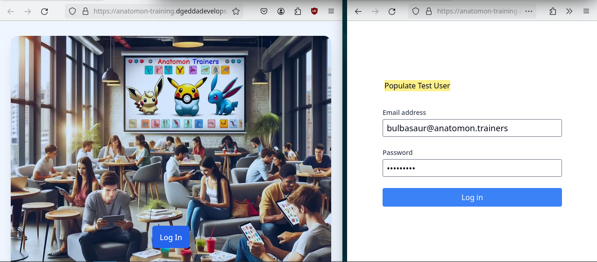
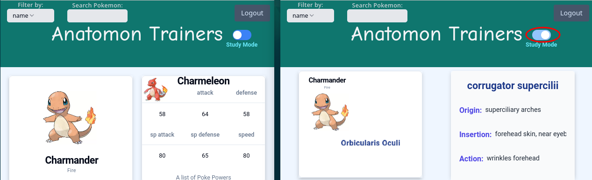
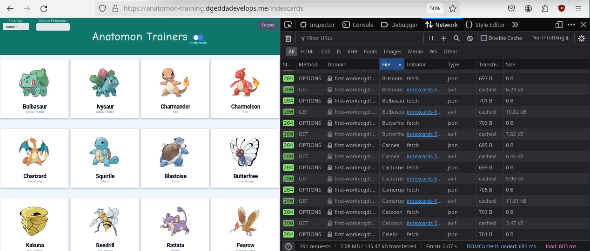

# Anatomon Trainers #
A study app with a youthful interface

Developed with Remix

Populate test user and login

Click on Study Mode Toggle and Pokemon cards become Myology flash cards

### Live app at https://anatomon-training.dgeddadevelops.me
## Technologies & Workflows
Auth:
- Login functionality with session authentication with HTTP only cookie
- J.W.T. for authorization with Cloudflare CDN

Cloudflare:
- Coordination of K/V Cache and R2 Bucket with Worker to serve static assets from edge locations
- Caching directives in Worker and lazy loading in Remix optimize performance and minimize network requests

Image:
- Initial setup of avif and webp formats and logic for efficient image serving implemented in Worker anticipating significant cost savings as app scales

GitHub:
- Continuous Integration pipeline with linting and testing workflows setup with GitHub Actions with Continuous Deployment to Fly.io
---
---

### Sample of Network Tab

#### Implementing a strategy to convert images into webp and avif formats, categorizing them into specific folders on an S3 Bucket, and embedding logic within a Worker to deliver images based on the Client's Accept Header provides significant cost efficiencies compared to outsourcing image optimization to a cloud provider. (Plans to link to Gist here)
## Future Features & Enhancements:
- Captcha
- Localization Workflow for Spanish & French (looking forward to this!)
- Integration of a Pomodoro Timer in Study Mode

